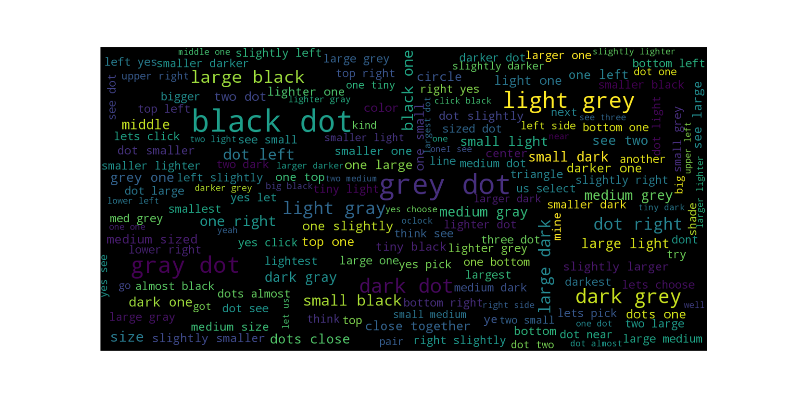

# Find One In Common!

Repository for "A Natural Language Corpus of Common Grounding under Continuous and Partially-Observable Context" (Udagawa et al., AAAI 2019)

In Preparation (Coming soon!)

# Generating Scenarios

To create 100 scenarios with number of shared entities = 4, 5 and 6 each, run

```
python generate_scenarios.py --num_world_each 100 --min_shared 4 --max_shared 6
```

# Dataset Analysis

The results of the paper can be reproduced by running

```
python simple_analysis.py --basic_statistics --count_dict --plot_selection_bias
```


# Visualization

This figure is plotted with [word cloud generator](https://github.com/amueller/word_cloud).

<p align="center">
    
</p>